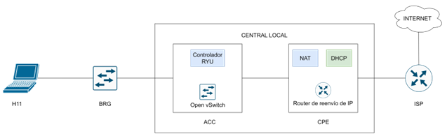
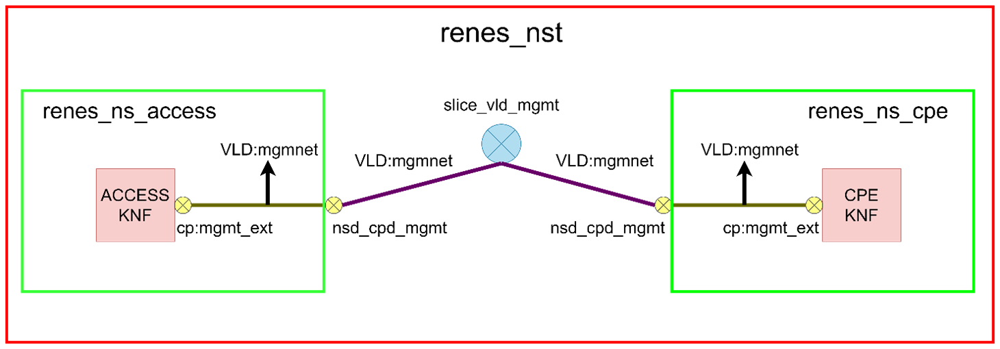
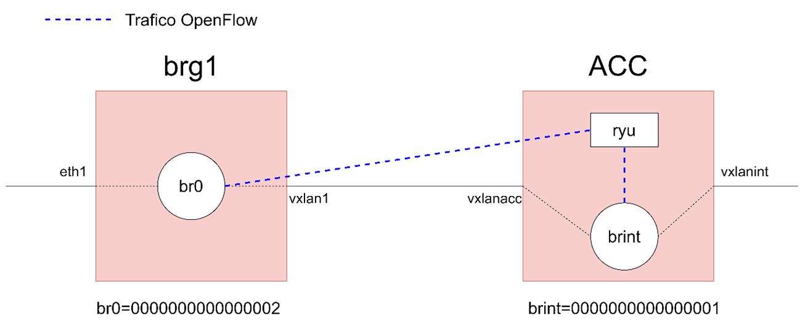

# TFMjmcoiduras
En este repeosistorio se presentan las configuraciones llevadas a cabo en el trabajo de fin de master en el cual se estudia una solución de network slice implementada en escenarios virtualizados

# Escenario residencial

# Arquitectura de red

# Arquitectura OSM

# Arquitectura SDN

# Escenario SD-WAN

